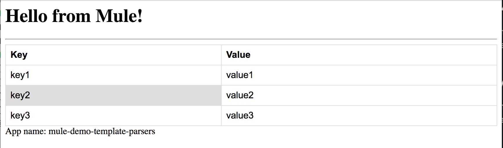

# Mule Demo for Template Parsers
This demo project shows how templates can be used in mule and transformed into nice html pages.

## Mule Velocity Template Parser
This custom transformer can parse templates written in Apache Velocity Template Language.

### Dependency
To use this transformer, apache velocity dependency needs to be added to project -

```
<dependency>
	<groupId>org.apache.velocity</groupId>
	<artifactId>velocity</artifactId>
	<version>1.7</version>
</dependency>
```

### Using the transformer
Checkout the `mule-demo-velocity-template-parser` flow in in `/src/main/app/mule-demo-template-parsers.xml`.

In short, it can be included in your flow as -
```
<custom-transformer class="com.javastreets.mule.transformers.VelocityTransformer" doc:name="Java" mimeType="text/html">
	<spring:property name="templatePath" value="templates/vm/index.vm"/>
</custom-transformer>
```

There are example templates at `src/main/resources/templates/vm/`.

### Run Demo
Clone this project and build with `mvn package`. Deploy the mule application generated in `target` folder to mule and run `http://localhost:8081/templates/vm`. Here is a screenshot -


